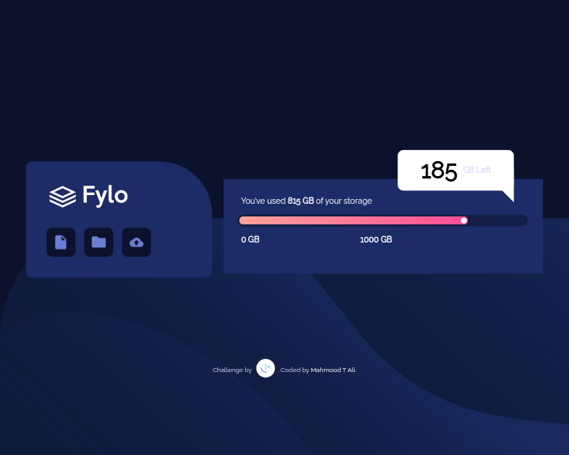

# Frontend Mentor - NFT preview card component solution

This is a solution to the [NFT preview card component challenge on Frontend Mentor](https://www.frontendmentor.io/challenges/nft-preview-card-component-SbdUL_w0U). Frontend Mentor challenges help you improve your coding skills by building realistic projects. 

## Table of contents

- [Overview](#overview)
  - [The challenge](#the-challenge)
  - [Screenshot](#screenshot)
  - [Links](#links)
- [My process](#my-process)
  - [Built with](#built-with)
  - [What I learned](#what-i-learned)
  - [Useful resources](#useful-resources)
- [Author](#author)

## Overview

### The challenge

Users should be able to:

- View the optimal layout depending on their device's screen size
- See hover states for interactive elements

### Screenshot

### Links

- Solution on github: [here](https://github.com/mahmood601/nft-preview-card-component-main)
- Live Site: [here](https://mahmood601.github.io/nft-preview-card-component-main)

## My process

### Built with

- CSS custom properties
- Flexbox
- Mobile-first workflow

### Useful resources

- [Elzero Web School](https://elzero.org/) - This website help people to learn programming and web developement by Mr Osama Mohammad
- [CSS Tricks](https://css-tricks.com) - This is an amazing website for learning CSS in professional way

## Author

- Website - [Mahmood](https://github.com/mahmood601)
- Frontend Mentor - [@Mahmood](https://www.frontendmentor.io/profile/mahmood601)

